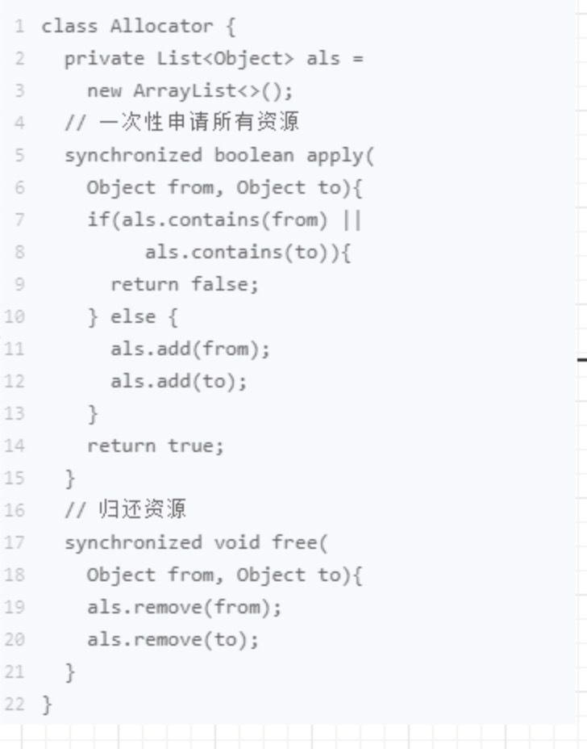
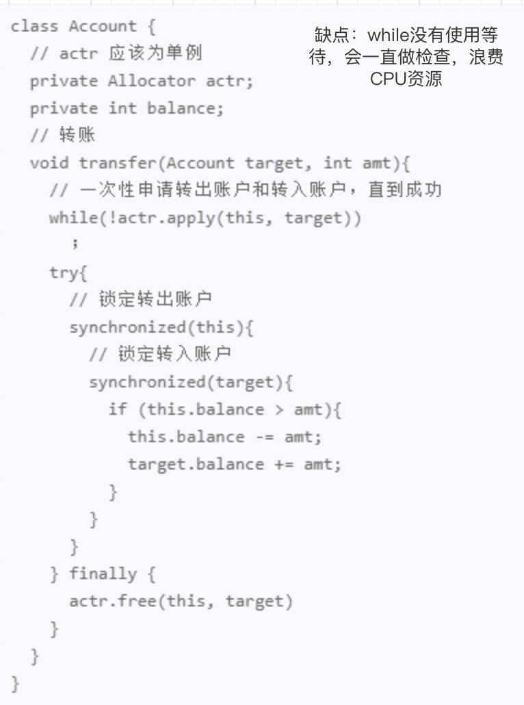
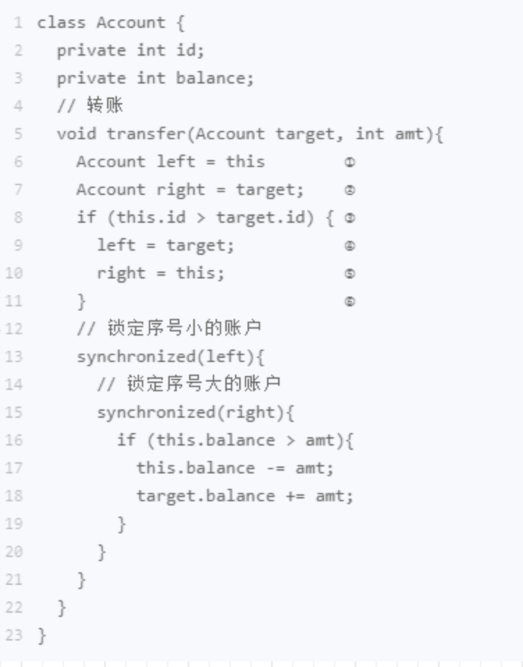
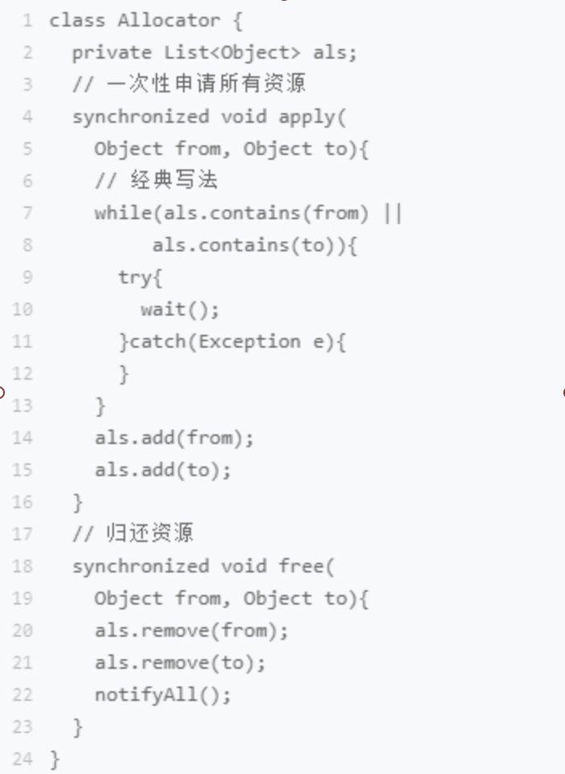

### 死锁发生条件
1. 互斥，共享资源 X 和 Y 只能被一个线程占用；
2. 占有且等待，线程 T1 已经取得共享资源 X，在等待共享资源 Y 的时候，不释放共享资源 X；
3. 不可抢占，其他线程不能强行抢占线程 T1 占有的资源；
4. 循环等待，线程 T1 等待线程 T2 占有的资源，线程 T2 等待线程 T1 占有的资源，就是循环等待。

如何防止死锁？

### 破坏占用且等待条件：
用一个全局类来管理锁 ，多把锁要么都给，要么一个都不给。这样就不会某把锁被占有且在等待另一把锁

### 破坏不可抢占条件
主动释放它占有的资源

### 破坏循环等待条件
对资源进行排序，然后按序申请资源。例如：每个资源都要一个id，对id进行比较，规定都先拿id小的锁

### 用“等待-通知”机制优化循环等待
每个互斥锁都有自己独立的等待队列。

### 尽量使用 notifyAll()
notify() 是会随机地通知等待队列中的一个线程，而 notifyAll() 会通知等待队列中的所有线程。
假设我们有资源 A、B、C、D，线程 1 申请到了 AB，线程 2 申请到了 CD，此时线程 3 申请 AB，会进入等待队列（AB 分配给线程 1，线程 3 要求的条件不满足），线程 4 申请 CD 也会进入等待队列。我们再假设之后线程 1 归还了资源 AB，如果使用 notify() 来通知等待队列中的线程，有可能被通知的是线程 4，但线程 4 申请的是 CD，所以此时线程 4 还是会继续等待，而真正该唤醒的线程 3 就再也没有机会被唤醒了。